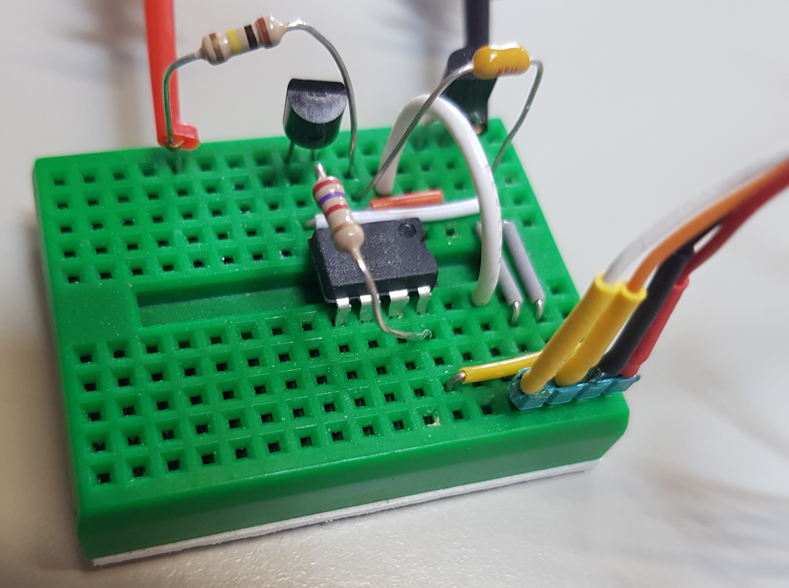

# Raspberry PI : mesure d'une tension continue
`pour me contacter : jmb52.dev@gmail.com`   
`dépot github : https://github.com/josmet52/rpidcmes`

## Préambule

Le Raspberry PI est un ordinateur mono-carte de petite taille qui tourne
sous Raspberry-OS (distribution de Debian). Le PI offre un bus complet
d'entrées sorties numérique mais aucune entrée analogique.

Le but de mon projet est de permettre de suivre de l'état de charge de la
batterie d'une alimentation sans coupure afin d'assurer un arrêt propre
du système en cas de coupure de courant. La batterie LIPO que j'utilise 
voit sa tension varier de 4.2 à 3.5 V.

## Introduction

Pour un projet sur Raspberry PI je dois assurer une alimentation sans interruption 
en cas de chute du réseau électrique. J'ai trouvé des solutions chez différents 
fournisseurs pour assurer proprement la transition entre le réseau et 
la batterie mais ces système ne permettent pas d'informer le PI que la batterie est
bientôt vide et qu'il faudrait arrêter proprement le système d'exploitation.

Dans ce but j'ai développé et testé plusieures variantes toutes basées
sur le même principe soit: mesurer le temps que met un condensateur pour
se charger au travers d'une résistance jusqu'à une tension connue et, connaissant les caractéristiques du circuit RC, convertir ce temps en valeur de tension. Ces différents essais m'ont amené sur la solution que je propose aujourd'hui.

## Principe de base

La tension à mesurer est appliquée entre les bornes BAT_VCC et BAT-GND. La commande
RPI-CMD est relié sur la borne GPIO (8 dans mon cas) du PI configurée comme
une sortie et la sortie RPI-MES est reliée sur la borne GPIO (10 dans
mon cas) du PI configurée comme une entrée. Les Connexions RPI-VCC (borne 4) et
RPI-GND (borne 6) sont branchées sur le PI au +5V et à la masse. La masse du signal à mesurer (BAT-GND) et celle du PI (RPI-GND) sont reliées.

Le principe de fonctionnement est le suivant:

Avant de lancer une mesure la sortie RPI-CMD est mise à "1" ainsi le MOSFET T1
est rendu conducteur et décharge le condensateur C1. Pour lancer la mesure, le PI met l'entrée
CMD à "0" ainsi le MOSFET T1 se bloque et le condensateur peut se charger au travers de la
résistance R1 alimentée par la tension à mesurer. Lorsque la tension aux
bornes du condensateur atteint la tension VTRIG (2.5V dans mon cas), le comparateur IC1 fait passer sa
sortie de "1" à "0". Le PI mesure le temps écoulé entre le lancement
de la mesure et le moment ou un flanc descendant est détecté RPI-MES. Connaissant les caractéristiques du circuit R1, C1 le programme calcule la valeur de la tension appliquée à l'entrée BAT_VCC.

## Limites du principe utilisé

#### Courant consommé sur le point de mesure

En branchant l'entrée sans amplificateur directement sur le point à
mesurer on consomme du courant sur cette source. Comme
la valeur de la résistance est de 100kΩ, le courant max tiré du point de
mesure, pour une tension à mesurer de 10V est de 100 μA. A l'utilisateur de déterminer si cela est
acceptable. Dans mon cas aucun problème car je mesure la tension de la
batterie de l'alimentation sans coupure.

#### Plage de tension admissible

Le principe utilisé n'autorise pas de tension mesurée en dessous de 2.7V
pour assurer que la tension aux bornes du condensateur puisse atteindre
2.5V et faire basculer la sortie du comparateur. La tension maximale qui
peut être appliquée est limitée par le comparateur LM393 et peut
atteindre 36V. Cependant comme il n'y a aucune protection entre l'entrée
de mesure et le PI, un défaut du LM393 pourrait amener la tension
d'entrée directement sur la borne RPI-MES ou, si le MOSFET devenait
défectueux, sur la borne RPI-CMD. Je recommande donc de ne pas dépasser
la tension max admissible par le port GPIO du PI soit 5V mais personnellement je considère le risque comme très faible et je l'utilise pour des tensions jusqu'à 15V.

## Qualité de la mesure

Le principe de mesure dépend très fortement du temps de latence du PI.
Si le processeur est occupé à d'autres tâches prioritaires, le temps de
latence peut varier sur une ou deux mesures. Pour écarter
ces mauvaises mesures je fais un grand nombre de mesures et rejette
celles qui sont en dehors de 1.5 écarts types de l'ensemble des mesures
puis je fais la moyenne des mesures restantes. 

En effectuant chaque fois 10 à 20 mesures, en rejetant celles dont l'écart type est trop élevé et en moyennant les mesures restantes, la précision de la mesure, déterminée empiriquement, est de +/- 0.1 à 0.2 V

## Software

Le software est écrit en Python est peut être téléchargé depuis GitHub
par le lien: <https://github.com/josmet52/rpidcmes>

## Nomenclature

Les composants utilisés sont:

-   T1 = BS170 -- MOSFET canal N
-   D1 = LM336-2.5V - diode de référence de 2.5V
-   IC1 = LM393N - Low-Offset Voltage, Dual Comparators
-   R1 = 100kΩ -- Résistance
-   R2 = 2.7kΩ -- Résistance
-   C1 = 1μF -- Condensateur céramique

## Photos

Prototype

Montage cablé sur le PI

## pidcmes_lib.py
la classe Pidcmes comprend un exemple d'application qui peut être exécuté directement en exécutant la classe. La partie main de ce programme peut servir d'exemple pour une mise en oeuvre dans un autre projet.

